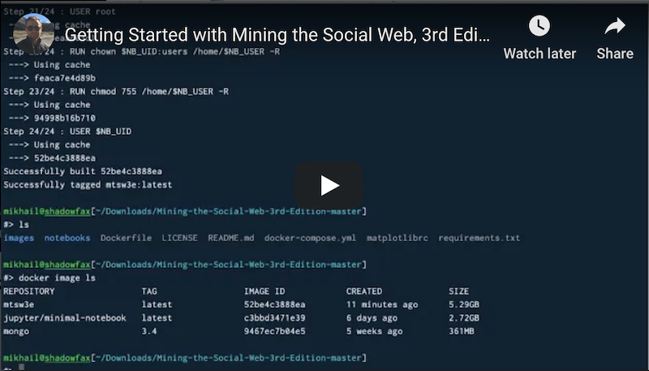
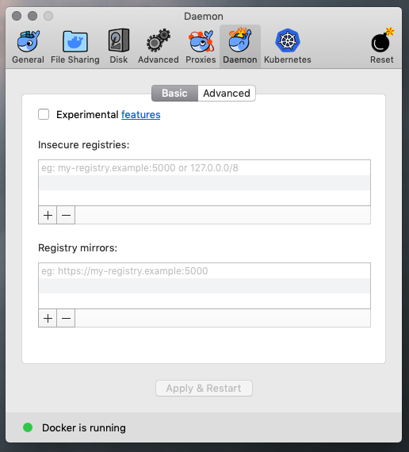
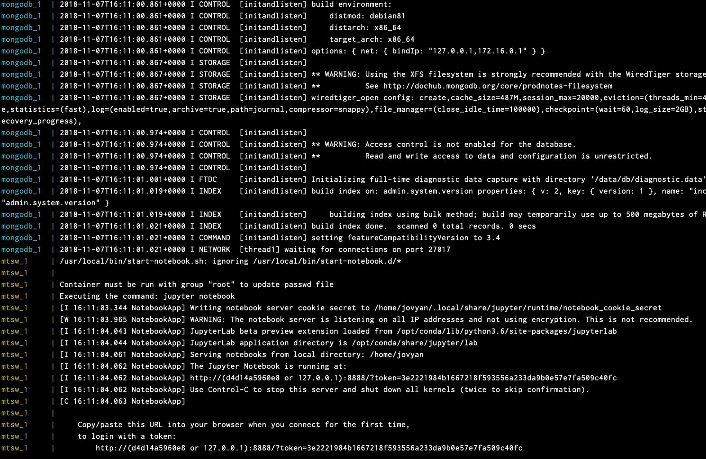

# Mining the Social Web, 3rd Edition

The official code repository for Mining the Social Web, 3rd Edition (O'Reilly, 2018). The `notebooks` folder of this repository contains the latest bug-fixed sample code used in the book chapters.

## Quickstart

There are several ways to get up and running with the sample code in MTSW, which we detail in this section, or you can follow along with the youtube video below:

#### Mac OS

[](http://www.youtube.com/watch?v=OZunBKFIdLU)

#### Windows

*Coming Soon!*

### Step 1: Cloning or Downloading the Repository

If you are familiar with git and have a git client installed on your machine, simply clone the repository to your own machine. However, it is up to you to install all the dependencies for the repository. The necessary Python libraries are detailed in the `requirements.txt` file. The other requirements are detailed in the **Requirements** section below.

If you prefer not to use a git client, you can instead [download a zip archive](https://github.com/mikhailklassen/Mining-the-Social-Web-3rd-Edition/archive/master.zip) directly from GitHub. The only disadvantage of this approach is that in order to synchronize your copy of the code with any future bug fixes, you will need to download the entire repository again. You are still responsible for installing any dependencies yourself.

### Using Docker

A better way that also ensures that all dependencies are downloaded is using Docker.

Docker is a tool for creating a "containerized" version of software that is independent of the underlying operating system. The included `Dockerfile` is the recipe that creates an "image" of all the software you need to run the sample code for MTSW, including all of the dependencies. This software image runs within the container managed by the Docker client on your machine.

The authors recommend using Docker. You won't have to worry about which operating system you're using, whether Windows, MacOS, or some Linux variant. You also won't have to worry about installing anything beyond the Docker client.

### Step 2: Installing Docker

Visit the [Docker Hub](https://hub.docker.com/search?q=&type=edition&offering=community) and download the free community edition of Docker Desktop for your operating system.

> **NOTE** that versions of Mac OS previous to Sierra 10.12 or versions of Microsoft Windows previous to 10 Professional or Enterprise 64-bit will require that you install the [Docker Toolbox](https://docs.docker.com/toolbox/overview/) instead.

After installing Docker Desktop, run the Docker Desktop application. We will be accessing it from the command line. To make sure that it is installed correctly, type the following from the command line.
```
docker --version
```
This should display something like
```
Docker version 18.09.0, build 4d60db4
```
If so, congratulations, you've successfully installed Docker.

### Step 3: Download or Build the Docker Image of this Repository

#### Option 1: Download the `mining-the-social-web-3rd-edition` image from Docker Hub

The Docker image of has been pre-built and is hosted on [Docker Hub](https://hub.docker.com/). To download this (~2GB) image, type the following command into your terminal:
```
docker pull mikhailklassen/mining-the-social-web-3rd-edition:latest
```

Next, let's tag the image to something a little shorter. Type the following command into the terminal:
```
docker tag mikhailklassen/mining-the-social-web-3rd-edition:latest mtsw3e:latest
```

#### Option 2: Build the image yourself

The Docker image is build using the `Dockerfile`, which is a recipe that tells the Docker client how to build the image. From within the same directory as this repository's `Dockerfile`, type
```
docker build -t mtsw3e .
```
This will "tag" your image with the name `mtsw3e`. Building the image will take some time. The Docker client has to download a base image and then install all of the dependencies. You will only need to do this once, provided you don't delete the image from your computer.

Some users report the following error (noted on MacOS):
```
$ docker build -t mtsw3e .
ERRO[0000] failed to dial gRPC: unable to upgrade to h2c, received 502 
context canceled
```
If this happens to you, disable the experimental features by unchecking the option in your Docker preferences.



Once you've built the image you should see it in your list of images:
```
$ docker image ls

REPOSITORY            TAG                 IMAGE ID
mtsw3e                latest              326387cea398
```

### Step 4: Launch the Application

The last step is to run `docker-compose`, which will launch the container we just built and connect it to a MongoDB database running in a separate container, which is needed for some of the code examples  
```
$ docker-compose up
```

The output will look something like this:


You will see the instruction on the screen to copy/paste the URL into your web browser's search bar. Copy and paste the version of this URL that points to `127.0.0.1`, e.g.
```
http://127.0.0.1:8888/?token=9f568d96a24a950fb9525ee2746fcdd1c04e035122067be3
```

If you do this, you should see a Jupyter Notebook server running and a list of all the Jupyter Notebooks that are a part of this repository.

When you are down working with the sample code, shut down the container as follows: hit `CTRL-C` in the terminal window where your app is running to interrupt Docker. Next, type
```
docker-compose down
```

This performs a clean shutdown of any infrastructure set up by Docker and stops all running containers.

## Requirements

If you just to run the sample code on your own machine outside of any Docker container, you will need to install all the requirements yourself.

Assuming you have Python 3.3+ installed, it is best practice to create a [virtual environment](https://docs.python.org/3/library/venv.html):
```
python3 -m venv mtsw
```
This creates a folder called `mtsw`. Change into this directory and activate the virtual environment. On Mac OS or Linux:
```
cd mtsw
source bin/activate
```

Then use pip to install all requirements:
```
pip install -r requirements.txt
```

You will also need to install the [Java Development Kit](https://www.oracle.com/technetwork/java/javase/downloads/jdk8-downloads-2133151.html), which is required by boilerpipe.

If you wish to complete all the examples in Chapter 9, you will need to install [MongoDB](https://www.mongodb.com/).

## Contributing

There are several ways in which you can contribute to the project. If you discover a bug in any of the code, the first thing to do is to create a new issue under the Issues tab of this repository. If you are a developer and would like to contribute a bug fix, please feel free to fork the repository and submit a pull request.
